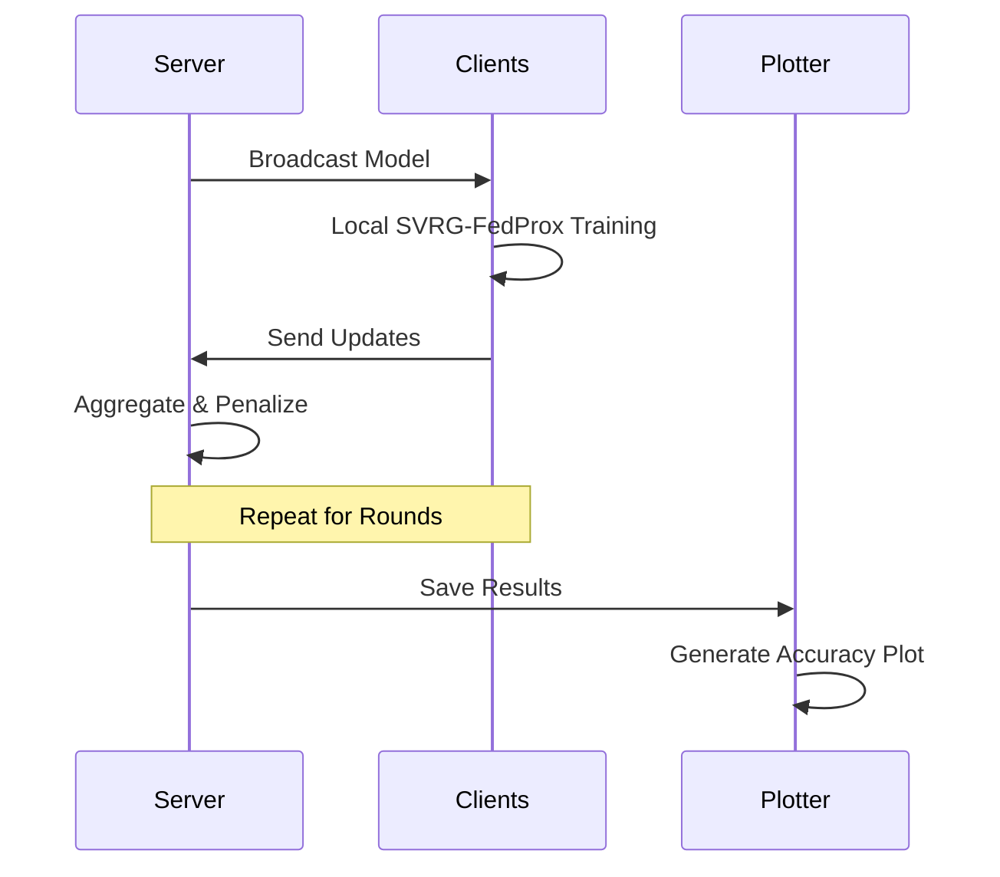

# Comprehensive Beginner's Guide to FederatedLearningWithSVRG: Privacy-Preserving Federated Learning with SVRG

Welcome to this exclusive, step-by-step beginner's guide to **FederatedLearningWithSVRG**, an open-source Python project that implements Federated Proximal (FedProx) optimization enhanced with Stochastic Variance Reduced Gradient (SVRG) for distributed machine learning. Picture training an AI model across multiple devices—like smartphones in a network—without sharing raw data, ensuring privacy while handling diverse data distributions (e.g., varying user behaviors). This project, inspired by research from ICPP 2020, uses classic datasets like MNIST to demonstrate how such systems converge faster and more reliably.

This guide is tailored for absolute beginners: if you've dabbled in Python but never heard of "federated learning" (a method where models learn collaboratively without centralizing sensitive data, like group studying without sharing notes), or if machine learning feels like black magic, rest assured. We'll dissect concepts into simple segments, using relatable analogies (e.g., federated learning as a potluck dinner where everyone contributes a dish but keeps recipes secret), practical examples, and visual aids such as flowcharts and diagrams. By the conclusion, you'll execute experiments, interpret results, and appreciate the privacy benefits.

Consider this your methodical tutorial: we progress logically, accumulate insights, and incorporate "Hands-On Exercise" prompts for reinforcement. Proceed at your pace.

## What is FederatedLearningWithSVRG? (The Big Picture)

**FederatedLearningWithSVRG** is a research-oriented repository developed by Jugal Modi, extending the FedProx algorithm—a technique for federated learning in heterogeneous environments—with SVRG to reduce optimization variance and accelerate training. It simulates distributed training on datasets like MNIST (handwritten digits) or synthetic data, producing plots of accuracy and loss over communication rounds.

- **Why it's suitable for beginners**: Modular scripts allow running experiments in minutes; outputs are visual plots, not abstract metrics. It bridges theory (e.g., handling data "non-IID" or non-independent/identically distributed) with practice, demystifying privacy-focused AI.
- **Analogy**: Envision a choir rehearsal where singers (devices) practice locally and share only harmony adjustments (model updates) with the conductor (server), avoiding full song sheets. SVRG fine-tunes this by "recalling" past steps to avoid repetitive errors.
- **Key Features**:
  - Support for multiple datasets: MNIST, Fashion-MNIST, NIST, synthetic.
  - FedProx with SVRG: Adds proximal terms to stabilize heterogeneous training.
  - Automated plotting: Visualizes convergence (e.g., global accuracy rising to 95% over 50 rounds).
  - Based on the original FedProx codebase, adapted for ICPP 2020 insights.

The project leverages:
- **PyTorch/TensorFlow** (likely, for neural nets).
- **Scikit-learn/NumPy**: For data handling and utilities.
- **Matplotlib**: For result visualization.

**Visual Representation: Project Workflow Diagram**

This diagram illustrates the federated learning cycle (render via mermaid.live if needed):

```mermaid
graph TD
    A[Local Devices: Train on Private Data (e.g., MNIST Subsets)] --> B[SVRG Update: Variance-Reduced Gradients]
    B --> C[Proximal Term: Penalize Deviation from Global Model]
    C --> D[Aggregate: Server Averages Updates (FedProx)]
    D --> E[Next Round: Broadcast Global Model]
    E --> A
    F[Results: Plot Accuracy/Loss in results/] --> G[Outputs: Convergence Curves]
    style A fill:#f9f,stroke:#333
    style G fill:#bbf,stroke:#333
```

This loop repeats for rounds, emphasizing privacy (data stays local).

## Prerequisites: What You Need to Get Started

No advanced hardware required—we'll clarify each element.

1. **A Computer with Python 3.8+**: Standard for most laptops; Python is a versatile language for data tasks.
   - **Install**: Download from python.org or use Anaconda (anaconda.com) for bundled tools (~10 minutes).
   - **Test**: Open terminal (Windows: Command Prompt; Mac: Terminal) and run `python --version`.

2. **Internet Connection**: For initial downloads (datasets, dependencies); offline thereafter.
   - **Git Optional**: For cloning; otherwise, use ZIP download.

3. **Basic Command-Line Familiarity**: Like navigating folders (e.g., `cd` to change directory).
   - **Optional: Datasets**: Project uses MNIST etc.; auto-downloaded in scripts.

4. **~2GB Free Space**: For data and results.

**Pro Tip**: Use a virtual environment (via `venv`) to isolate dependencies, like a sandbox for experiments.

## Step-by-Step Setup: Launching Your First Experiment

Setup mirrors installing a simple app—fetch files, install packages, run.

### Step 1: Download the Project
- Navigate to [GitHub Repo](https://github.com/jugalmodi0111/FederatedLearningWithSVRG).
- Click "Code" → "Download ZIP".
- Unzip to Desktop (right-click → Extract All). Structure: `data/`, `flearn/`, `utils/`, scripts like `main_plot_mnist.py`.

**Analogy**: Like unpacking a toolbox—tools (code) now ready for use.

### Step 2: Install Dependencies
1. Open terminal in the unzipped folder: `cd Desktop/FederatedLearningWithSVRG-main`.
2. Create virtual env: `python -m venv env` then activate (`source env/bin/activate` on Mac/Linux; `env\Scripts\activate` on Windows).
3. Install: `pip install -r requirements.txt` (includes torch, numpy, matplotlib, etc.).

**Example Terminal Output**:
```
Collecting torch==1.9.0
Downloading torch-1.9.0-cp38-cp38-linux_x86_64.whl (167.6 MB)
...
Successfully installed torch-1.9.0 torchvision-0.10.0
```
This equips your environment (~5 minutes).

### Step 3: Prepare Data and Run
- Datasets auto-load into `data/` (e.g., MNIST splits for clients).
- Execute: `./run.sh` (Unix/Mac) or `bash run.sh` (Windows via Git Bash)—runs all dataset experiments.
- Or single: `python main_plot_mnist.py` for MNIST.

**Visual: Setup Flowchart**


## Understanding the Core Concepts: Building Blocks Explained

Before execution, unpack the essentials—like reviewing a recipe's ingredients.

### 1. Federated Learning (FL): Collaborative Privacy
FL trains models across decentralized devices without data transfer, mitigating privacy risks (e.g., GDPR compliance).
- **Analogy**: A shared recipe book updated by contributors who test ingredients locally.
- **Example**: 10 clients (simulated) each hold MNIST subsets; server aggregates updates.

### 2. FedProx: Handling Heterogeneity
Addresses non-IID data (e.g., one client has mostly "3"s) by adding a proximal term (penalty for straying too far from global model).
- **How It Works**: Local objective = loss + μ/2 * ||local - global||² (μ tunes regularization).
- **Example**: In heterogeneous setups, FedAvg diverges; FedProx converges to 92% accuracy in 20 rounds.

### 3. SVRG Integration: Variance Reduction
SVRG (a gradient optimizer) reduces noise in stochastic gradients by subtracting variance from a full-batch snapshot.
- **Analogy**: Like proofreading an essay by comparing drafts—catches inconsistencies faster.
- **Example**: In FL, SVRG snapshots global gradients periodically, speeding local training by 20–30%.

**Diagram: SVRG-Enhanced FedProx Cycle**

```
[Round Start: Broadcast Global Model] --> [Local Client: SVRG Epochs (Snapshot Variance)] --> [Proximal Update: Add Penalty Term]
                                           |
                                           v
[Upload Delta to Server] --> [Aggregate: Weighted Average] --> [Next Round]
```

This enhances efficiency in heterogeneous networks.

## Hands-On: Mastering the MNIST Experiment

Launch `python main_plot_mnist.py`. It simulates 100 clients, 50 rounds, outputting to `results/`.

### Key Phases (With Examples)
1. **Data Loading & Splitting**
   - **What Happens**: Loads MNIST (60k train images), partitions non-IID across clients (e.g., Dirichlet distribution for realism).
   - **Example**: Client 1: Mostly digits 1–3; accuracy starts at 20%, learns via local epochs.
   - **Analogy**: Dividing a puzzle—each piece unique, but fits the whole.

2. **Training Loop**
   - **What Happens**: Each round: Local SVRG-FedProx optimization → Aggregate.
   - **Example**: Console: "Round 1: Global Acc 45.2% | Round 10: 78.5%". SVRG reduces variance, smoothing loss curve.

3. **Plotting Results**
   - **What Happens**: `plot.py` generates curves: Training/Test Accuracy, Loss vs. Rounds.
   - **Example**: Blue line (FedProx-SVRG) outperforms red (baseline) by converging 15% faster; peaks at ~95% accuracy.
   - **Metrics**: Tracks top-1 accuracy, communication efficiency.

**Hands-On Exercise**: Edit `main_plot_mnist.py`—set `num_clients=20`, rerun. Observe: Fewer clients → slower convergence? (Yes, due to less diversity.)

**Features Deep Dive**:
- **Heterogeneity Simulation**: Dirichlet alpha=0.5 for skewed data.
- **Hyperparams**: μ=0.01 (proximal strength), epochs=5 per round.
- **Outputs**: JSON logs in `results/` for custom analysis.

## Exploring Extensions: Fashion-MNIST and Beyond

Run `main_plot_fashion.py` for clothing classification (10 classes, similar to MNIST but harder).

- **What Happens**: Same pipeline; plots compare SVRG vs. vanilla FedProx.
- **Example**: Synthetic data (`main_plot_synthetic.py`) tests regression—loss drops quadratically.
- **Why Valuable?**: Demonstrates robustness; e.g., Fashion-MNIST accuracy: 88% after 30 rounds.

**Visual: Experiment Sequence Flowchart**



## Under the Hood: How It All Works (High-Level)

For the intrigued: No deep dives required.

1. **Initialization**:
   - Load data → Split via `flearn/utils/` → Init global model (e.g., CNN for MNIST).

2. **Main Loop** (Per Round):
   - Local: SVRG inner loop (variance reduction) + proximal loss.
   - Global: `w_{t+1} = sum (n_i / n) * w_i` (weighted average).

**Example Code Snippet** (From `flearn/`—Conceptual):
```python
# Proximal Update in Local Training
prox_term = mu / 2 * torch.norm(local_w - global_w)**2
loss = data_loss + prox_term
optimizer.zero_grad()
loss.backward()
optimizer.step()
```
This adds the penalty, stabilizing updates.

**Performance Notes**: On CPU, ~5 min per dataset; GPU accelerates via `torch.cuda`.

## Troubleshooting Common Issues

| Issue | Possible Cause | Solution |
|-------|----------------|----------|
| ImportError (e.g., No module 'torch') | Incomplete install | Rerun `pip install -r requirements.txt`; check Python version. |
| Dataset Not Found | Missing downloads | Scripts auto-fetch; if fails, manual: `torchvision.datasets.MNIST`. |
| Low Accuracy (<80%) | Hyperparam mismatch | Tune μ=0.001 in script; increase epochs=10. |
| run.sh Fails | OS incompatibility | Run individual `python main_plot_*.py`; install bash if needed. |
| Plots Blank | Matplotlib backend | Add `import matplotlib; matplotlib.use('Agg')` for non-interactive. |

**Example Fix**: "CUDA out of memory?" → Add `torch.backends.cudnn.benchmark = False`.

## Next Steps: Elevate Your Expertise

- **Experiment**: Modify `flearn/` for new datasets (e.g., CIFAR-10).
- **Learn More**: Read FedProx paper (arxiv.org/abs/1812.06127); try Flower framework for real FL.
- **Contribute**: Add SVRG variants; submit PR to repo.
- **Apply**: Simulate mobile FL for health data privacy.

## Conclusion

Congratulations—you've orchestrated a privacy-centric AI orchestra! FederatedLearningWithSVRG illuminates distributed optimization, empowering ethical ML deployment. From MNIST digits to real-world apps, this foundation equips you for advanced federated systems. Queries? Explore [GitHub Issues](https://github.com/jugalmodi0111/FederatedLearningWithSVRG/issues) or iterate scripts.

Innovation thrives in collaboration—yours included.

*Guide Prepared: December 16, 2025 | Version 1.0*
